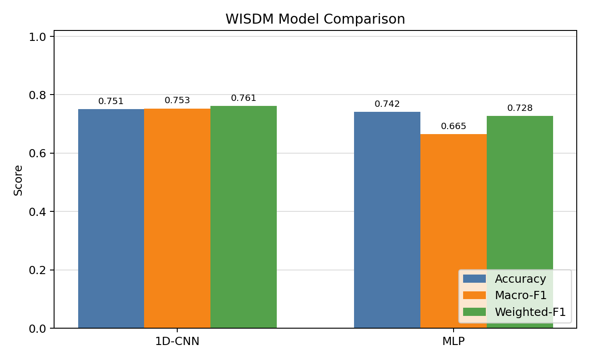
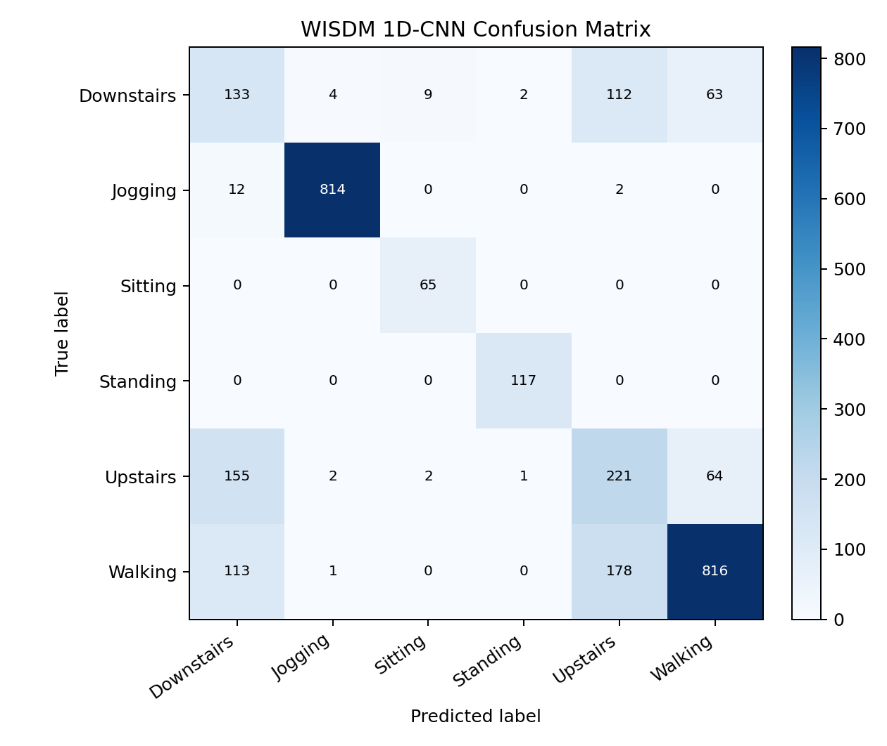
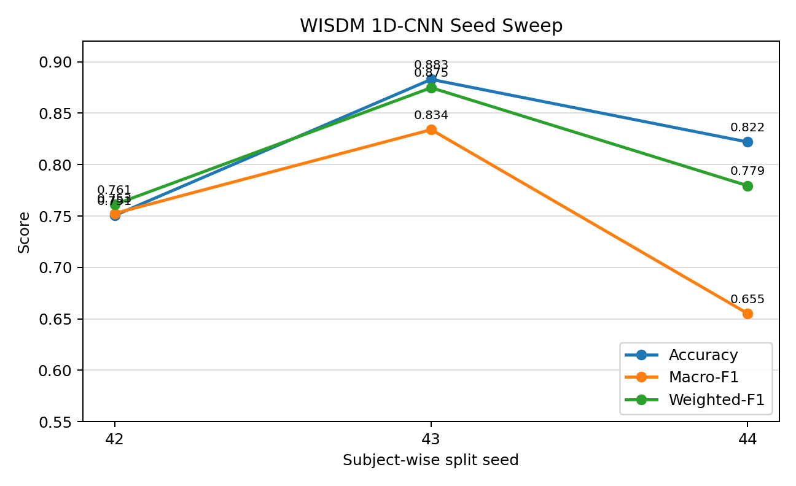

# Personalized On-device Activity Recognition from Wearable-like Motion Signals

This project studies lightweight activity recognition from mobile/wearable-like motion signals. It combines public human activity recognition benchmark evaluation with a personalized user-defined action recognition prototype based on self-collected accelerometer data.

The repository started as an early Python prototype for collecting mobile accelerometer streams, training a small Keras model, and running real-time prediction from a socket connection. The current direction is to keep that prototype accessible while adding a reproducible research-oriented pipeline for public benchmark evaluation, lightweight models, and TensorFlow Lite export.

## Motivation

- Wearable and edge AI for human-centered sensing.
- Real-time activity recognition from low-dimensional motion signals.
- Low-resource inference suitable for mobile or embedded deployment.
- Personalized/user-defined action recognition beyond fixed activity labels.
- Clear evaluation protocols that separate public benchmark results from small self-collected demos.

## Current Status

- The original Python prototype is still present in the root scripts (`recordData.py`, `processData.py`, `model.py`, `main.py`, `visualization.py`).
- A new benchmark-oriented Python package has been added under `src/activity_recognition/`.
- WISDM and UCI HAR public benchmark support, MLP/1D-CNN/TinyTCN baselines, training/evaluation scripts, TensorFlow Lite export, and local CPU latency benchmarking are implemented.
- The Android data-collection client exists separately at <https://github.com/codemaivanngu/CollectAccelerometerDatav2>.
- Full Android on-device inference is planned through TensorFlow Lite, but this repository currently benchmarks TFLite on the developer machine CPU unless integrated into the Android client.

## Repository Relation

The Android data collection and streaming client is maintained separately:

<https://github.com/codemaivanngu/CollectAccelerometerDatav2>

Current prototype architecture:

```text
Android sensor client -> Python socket server/predictor -> real-time label/plot
```

Planned mobile architecture:

```text
Android sensor client -> on-device preprocessing -> TFLite inference -> real-time label display
```

Android Studio is only needed for the mobile demo. The Python benchmark pipeline in this repository can be run without Android Studio.

## Project Layout

```text
configs/                         WISDM and UCI HAR experiment configs
src/activity_recognition/         New research-oriented Python package
scripts/                          CLI entry points for data, train, eval, export, benchmark
docs/                             Project protocol and limitation notes
results/                          Placeholder for lightweight result notes
tests/                            Smoke/unit checks for windowing and models
recordData.py                     Original socket data recorder
processData.py                    Original CSV preprocessing prototype
model.py                          Original Keras training experiment
main.py                           Original real-time Python predictor
visualization.py                  Original plotting helper
```

## Planned and Implemented Pipeline

Public benchmark path:

```text
WISDM dataset
or UCI HAR dataset
-> preprocessing/windowing or pre-windowed inertial signals
-> benchmark-specific train/validation/test split
-> train MLP, 1D-CNN, or TinyTCN
-> evaluate accuracy, macro-F1, classification report, confusion matrix
-> export TensorFlow Lite
-> benchmark local CPU latency and model size
```

Personalized demo path:

```text
self-collected accelerometer data
-> user-defined labels
-> train or fine-tune lightweight classifier
-> real-time prediction prototype
```

Self-collected data is treated as a personalization and user-defined action demo, not as standalone scientific evidence of broad generalization.

## Install

Preferred setup with `uv`:

```bash
uv sync
```

Fallback setup with `pip`:

```bash
python3 -m venv .venv
source .venv/bin/activate
pip install -r requirements.txt
```

For local imports from `src/`, run scripts from the repository root through `uv run` or an activated environment. For test runners, `pytest.ini` configures `src` as the Python path.

## Prepare WISDM

The repository does not commit WISDM data. Use the helper script:

```bash
uv run python scripts/download_wisdm.py --out data/raw/wisdm
```

If automatic download fails, place the classic WISDM raw file here:

```text
data/raw/wisdm/WISDM_ar_v1.1_raw.txt
```

If the Fordham endpoint times out, the same archive can also be fetched from the Google Drive mirror referenced in the Curiousily WISDM tutorial:

```bash
uvx gdown 152sWECukjvLerrVG2NUO8gtMFg83RKCF -O data/raw/wisdm/WISDM_ar_latest.tar.gz
tar -xzf data/raw/wisdm/WISDM_ar_latest.tar.gz -C data/raw/wisdm
```

Expected raw row format:

```text
user,activity,timestamp,x,y,z;
```

## Additional Dataset: UCI HAR

UCI HAR is a recognized smartphone-based human activity recognition benchmark that uses pre-windowed 128-step inertial signals. It complements WISDM by testing the lightweight pipeline on a second public dataset with an official train/test split.

This benchmark is used for credibility and reproducibility. The self-collected accelerometer workflow remains the personalized/user-defined action demo.

Download and extract the dataset:

```bash
uv run python scripts/download_uci_har.py --out data/raw/uci_har
```

Expected extracted directory:

```text
data/raw/uci_har/UCI HAR Dataset/
```

The first UCI HAR configs use these six channels by default:

```text
total_acc_x, total_acc_y, total_acc_z, body_gyro_x, body_gyro_y, body_gyro_z
```

## Train

Train the 1D-CNN baseline:

```bash
uv run python scripts/train_wisdm.py --config configs/wisdm_cnn1d.yaml
```

Train the MLP baseline:

```bash
uv run python scripts/train_wisdm.py --config configs/wisdm_mlp.yaml
```

Train a generic HAR config, including UCI HAR:

```bash
uv run python scripts/train_har.py --config configs/uci_har_cnn1d.yaml
uv run python scripts/train_har.py --config configs/uci_har_tinytcn.yaml
```

Optional runtime overrides:

```bash
uv run python scripts/train_wisdm.py \
  --config configs/wisdm_cnn1d.yaml \
  --seed 43 \
  --output-dir outputs/wisdm_cnn1d_seed43
```

Each run writes model and metadata under the configured `outputs/...` directory. The WISDM configs use `EarlyStopping` and `ModelCheckpoint` on validation accuracy with patience 5. When a validation set exists, `model.keras` is saved from the best validation checkpoint, and `best_model.keras` is kept beside it for traceability.

## Evaluate

```bash
uv run python scripts/evaluate_wisdm.py \
  --config configs/wisdm_cnn1d.yaml \
  --run-dir outputs/wisdm_cnn1d
```

Generic HAR evaluation:

```bash
uv run python scripts/evaluate_har.py \
  --config configs/uci_har_cnn1d.yaml \
  --run-dir outputs/uci_har_cnn1d

uv run python scripts/evaluate_har.py \
  --config configs/uci_har_tinytcn.yaml \
  --run-dir outputs/uci_har_tinytcn
```

Evaluation outputs include:

- `metrics.json`
- `classification_report.txt`
- `confusion_analysis.json`
- `confusion_analysis.txt`
- `confusion_matrix.json`
- `confusion_matrix.png`

WISDM uses a subject-wise split to reduce leakage from overlapping windows across the same person. UCI HAR uses its official train/test split, with validation carved from official training subjects.

## Export TensorFlow Lite

```bash
uv run python scripts/export_tflite.py \
  --model outputs/wisdm_cnn1d/model.keras \
  --out outputs/wisdm_cnn1d/model.tflite
```

Export a UCI HAR TinyTCN model:

```bash
uv run python scripts/export_tflite.py \
  --model outputs/uci_har_tinytcn/model.keras \
  --out outputs/uci_har_tinytcn/model.tflite
```

Optional float16 weight quantization:

```bash
uv run python scripts/export_tflite.py \
  --model outputs/wisdm_cnn1d/model.keras \
  --out outputs/wisdm_cnn1d/model.float16.tflite \
  --float16
```

## Benchmark TFLite

```bash
uv run python scripts/benchmark_tflite.py \
  --model outputs/wisdm_cnn1d/model.tflite \
  --input-shape 1,128,4
```

Benchmark a UCI HAR TinyTCN export:

```bash
uv run python scripts/benchmark_tflite.py \
  --model outputs/uci_har_tinytcn/model.tflite \
  --input-shape 1,128,6
```

This is a CPU benchmark on the developer machine, not a real Android latency measurement. Android latency should be measured inside the Android client or with Android benchmarking tools after integration.

## Optional Qualcomm AI Hub Profiling

Exported TFLite HAR models can optionally be profiled on Qualcomm AI Hub. Local CPU benchmarks remain the reproducible baseline proxy, while Qualcomm AI Hub profiling provides deployment-oriented evidence on cloud-hosted Qualcomm devices.

This workflow is optional and requires local Qualcomm credentials. See [docs/qualcomm_ai_hub.md](docs/qualcomm_ai_hub.md). Do not interpret Qualcomm AI Hub latency as Android app end-to-end latency unless it is measured inside the Android app.

Latest UCI HAR TinyTCN Qualcomm AI Hub structured metrics:

| Requested unit | Job ID | Runtime path | Delegate coverage | Cold load ms | Warm load ms min/mean/max | Inference ms | Inference 100x wall s | By-layer 100x wall s | Inference memory increase MB | Status |
| --- | --- | --- | --- | ---: | --- | ---: | ---: | ---: | --- | --- |
| CPU | `j5wm0e06g` | `cpu_only` | XNNPACK, 14 / 21 nodes | 10.280 | 1.214 / 3.824 / 6.557 | 0.036 | 0.005 | 0.009 | 0.000-0.000 | success |
| NPU | `jp3qljll5` | `cpu_and_npu` | QNN/HTP, 17 / 21 nodes | 322.381 | 171.114 / 179.576 / 195.312 | 0.300 | 0.034 | 0.093 | 0.000-0.086 | success |

Memory ranges are converted from Qualcomm runtime log `usage` fields from kB to MB. The table reports the profiler's `increase` range for the inference phase, not Android app end-to-end memory.

NPU Runtime Analysis placement from Qualcomm Workbench:

| Source | NPU QNN layers | CPU TfLite fallback layers | CPU fallback ops | NPU compute cycles | Kernel timing sum |
| --- | ---: | ---: | --- | ---: | ---: |
| `jp3qljll5` Runtime Analysis | 17 / 21 | 4 / 21 | `SPACE_TO_BATCH_ND` x2, `BATCH_TO_SPACE_ND` x2 | 85,852 | 45 us |

The Workbench layer timing sum is kernel-level timing. The runtime log by-layer total for the NPU job is 0.854 ms because it includes delegate partition timing and profiler overhead.

Numeric parity between local TFLite and AI Hub output on a deterministic synthetic sample:

| Requested unit | Job ID | Allclose at 1e-4 | Top class local / AI Hub | Max abs diff | Mean abs diff |
| --- | --- | --- | --- | ---: | ---: |
| CPU | `jp4j6lq8p` | true | 4 / 4 | 5.96e-08 | 3.07e-08 |
| NPU | `jpe40d1o5` | false | 4 / 4 | 1.09e-03 | 3.16e-04 |

The NPU/QNN path keeps the same predicted class but does not meet the strict `1e-4` numeric tolerance for this sample. This is recorded as a parity finding, not hidden as a pass.

Regenerate structured Qualcomm metrics from local runtime logs with:

```bash
uv run python scripts/export_qaihub_profile_metrics.py \
  --logs j5wm0e06g_runtime.log jp3qljll5_runtime.log
```

Run repeated profiles and parity checks with:

```bash
uv run --extra qualcomm python scripts/run_qaihub_repeated_profiles.py \
  --model outputs/uci_har_tinytcn/model.tflite \
  --input-shape 1,128,6 \
  --compute-units cpu npu \
  --runs 5 \
  --wait

uv run --extra qualcomm python scripts/qaihub_numeric_parity.py \
  --model outputs/uci_har_tinytcn/model.tflite \
  --input-shape 1,128,6 \
  --compute-unit cpu \
  --wait
```

For this small TinyTCN model, the requested NPU path completes successfully but is slower than the CPU/XNNPACK path, likely because delegate and dispatch overhead dominate the tiny workload.

## Hardware-Aware Deployment Profiling

V5 extends the v4 TinyTCN finding into a CPU/GPU/NPU complexity sweep. The main deployment question is when a model becomes large and accelerator-friendly enough for GPU or NPU execution to justify delegate setup, dispatch, memory movement, and fallback overhead.

Detailed local report can be regenerated at `reports/report_v5_cpu_gpu_npu_complexity_sweep.md` from ignored benchmark artifacts with `scripts/generate_v5_report.py`.

Local UCI HAR TFLite results on this development machine:

| Model | Params | Accuracy | TFLite size | Mean ms | P95 ms | Space/Batch fallback markers |
| --- | ---: | ---: | ---: | ---: | ---: | --- |
| TinyTCN | 14,598 | 0.896 | 65.11 KB | 0.0467 | 0.0853 | `SPACE_TO_BATCH_ND` x2, `BATCH_TO_SPACE_ND` x2 |
| TinyCNN1D | 20,582 | 0.905 | 89.49 KB | 0.0283 | 0.0470 | none |
| MediumConv1D | 252,870 | 0.902 | 1003.24 KB | 0.4547 | 0.8044 | none |

Qualcomm AI Hub v5 repeated profile results on Samsung Galaxy S24 (Family), 5 real hosted-device runs per model/runtime:

| Model | Unit | Runs | Mean ms | P95 ms | Memory MB | Energy/power |
| --- | --- | ---: | ---: | ---: | ---: | --- |
| TinyTCN | CPU | 5 / 5 | 0.035 | 0.041 | 0.061 | not exposed |
| TinyTCN | GPU | 5 / 5 | 0.245 | 0.272 | 0.031 | not exposed |
| TinyTCN | NPU | 5 / 5 | 0.297 | 0.302 | 0.033 | not exposed |
| TinyCNN1D | CPU | 5 / 5 | 0.023 | 0.025 | 0.465 | not exposed |
| TinyCNN1D | GPU | 5 / 5 | 0.242 | 0.270 | 0.017 | not exposed |
| TinyCNN1D | NPU | 5 / 5 | 0.066 | 0.070 | 0.031 | not exposed |
| MediumConv1D | CPU | 5 / 5 | 0.184 | 0.188 | 0.044 | not exposed |
| MediumConv1D | GPU | 5 / 5 | 0.665 | 0.790 | 0.089 | not exposed |
| MediumConv1D | NPU | 5 / 5 | 0.098 | 0.104 | 0.029 | not exposed |

Energy/power fields were checked in downloaded AI Hub profile artifacts and runtime logs. The current device tooling artifacts did not expose numeric energy or power measurements, so those columns are intentionally marked `not exposed`.

Hosted delegate breakdown matches the local op audit: TinyTCN NPU delegated 17 / 21 nodes and fell back on `SPACE_TO_BATCH_ND` and `BATCH_TO_SPACE_ND` in every run, while TinyCNN1D NPU and MediumConv1D NPU were fully delegated across all 5 runs.

Numeric parity used deterministic synthetic inputs across the same 3 model x 3 unit matrix. CPU passed strict `1e-4` allclose for all models. GPU and NPU preserved the predicted class and passed `1e-3`, but did not pass strict `1e-4`; max absolute differences were 0.000576-0.001086 for GPU and 0.000381-0.001052 for NPU.

Takeaway: hardware acceleration is model-dependent. For tiny HAR models, CPU/XNNPACK remains fastest in hosted-device profiling. Removing dilation removed Space/Batch fallback markers and improved local CPU latency, but TinyCNN1D is still small enough that CPU wins. MediumConv1D is large enough for NPU to win over CPU/GPU on the measured Samsung Galaxy S24 profile matrix.

## Repeated Seeds

Run the CNN pipeline for multiple subject-wise split seeds:

```bash
uv run python scripts/run_wisdm_seeds.py \
  --config configs/wisdm_cnn1d.yaml \
  --seeds 42 43 44 \
  --base-output-dir outputs/wisdm_cnn1d_seeds
```

The script trains, evaluates, exports TFLite, benchmarks each seed, and writes `seed_summary.json` plus `seed_results.csv`. Different seeds can produce different test subject sets, so both headline metrics and test supports should be interpreted as split-dependent.

## Additional Model: TinyTCN

TinyTCN is a lightweight temporal convolution baseline intended to capture longer temporal patterns than the simple 1D-CNN while remaining TensorFlow Lite friendly. It uses dilated `Conv1D` layers, global average pooling, and a small dense classifier without custom layers.

## Evaluation Metrics

The benchmark pipeline reports both classification quality and deployment-oriented efficiency metrics.

| Metric | What it measures | Why it matters here |
| --- | --- | --- |
| Accuracy | Fraction of test windows whose predicted class equals the ground-truth class. | Useful as a simple headline score, but can hide poor minority-class performance. |
| Precision per class | Of the windows predicted as a class, the fraction that are actually that class. | Helps identify false positives, for example predicting `jogging` too often. |
| Recall per class | Of the true windows from a class, the fraction recovered by the model. | Helps identify missed activities, for example failing to detect `walking` windows. |
| F1 per class | Harmonic mean of per-class precision and recall. | Balances false positives and false negatives for each activity. |
| Macro-F1 | Unweighted mean of per-class F1 scores. | Treats every activity equally, which is important when classes are imbalanced. |
| Weighted-F1 | Mean of per-class F1 weighted by test support. | Summarizes performance while accounting for class frequency. |
| Support | Number of test windows for each class. | Gives context for whether a per-class score is based on enough examples. |
| Classification report | Text/table summary of precision, recall, F1, and support. | Makes per-class behavior easy to inspect. |
| Confusion matrix | Counts of true labels versus predicted labels. | Shows which activities are confused with each other. |
| Model parameters | Number of trainable/non-trainable Keras parameters. | Rough proxy for model complexity and memory needs. |
| Keras model size | Size of the saved `.keras` model file. | Useful for artifact storage and comparing model variants before export. |
| TFLite model size | Size of the exported `.tflite` file. | Directly relevant to mobile/on-device deployment. |
| Mean latency | Average TFLite inference time across benchmark runs. | Quick estimate of typical local CPU inference cost. |
| Median latency | Middle TFLite inference time across benchmark runs. | More robust than mean when a few runs are slow. |
| P95 latency | 95th percentile TFLite inference time. | Captures tail latency, which matters for real-time responsiveness. |

### Latest WISDM Run

The following numbers come from real WISDM v1.1 raw accelerometer runs on this development machine. The original Fordham endpoint timed out from this environment, so the archive was downloaded from the Google Drive mirror referenced in the Curiousily WISDM tutorial and extracted to the ignored `data/raw/wisdm/` directory.

Run setup:

| Field | Value |
| --- | --- |
| Date | 2026-05-21 |
| Data source | WISDM v1.1 raw accelerometer file: `WISDM_ar_v1.1_raw.txt` |
| Parsed rows | 1,098,199 |
| Classes | `Downstairs`, `Jogging`, `Sitting`, `Standing`, `Upstairs`, `Walking` |
| Subjects | 36 |
| Split | Subject-wise train/validation/test |
| Seed 42 windows | 16,890 total; 11,528 train, 2,476 validation, 2,886 test |
| Window shape | `128 x 4` (`x`, `y`, `z`, magnitude) |
| Checkpoint policy | `model.keras` is the best validation-accuracy checkpoint |
| Early stopping | monitor `val_accuracy`, mode `max`, patience 5 |
| Python / TensorFlow | Python 3.11.6 / TensorFlow 2.21.0 |
| Local CPU | Intel Core i5-9300H CPU @ 2.40GHz |

Single-seed model comparison:

| Model | Params | Best epoch | Epochs run | Accuracy | Macro-F1 | Weighted-F1 | TFLite size | Mean ms | Median ms | P95 ms |
| --- | ---: | ---: | ---: | ---: | ---: | ---: | ---: | ---: | ---: | ---: |
| 1D-CNN | 11,430 | 2 | 7 | 0.751 | 0.753 | 0.761 | 49.28 KB | 0.0245 | 0.0203 | 0.0436 |
| MLP | 74,310 | 3 | 8 | 0.742 | 0.665 | 0.728 | 293.38 KB | 0.0097 | 0.0080 | 0.0147 |

1D-CNN seed sweep:

| Seed | Test windows | Best epoch | Accuracy | Macro-F1 | Weighted-F1 | Mean ms | P95 ms |
| ---: | ---: | ---: | ---: | ---: | ---: | ---: | ---: |
| 42 | 2,886 | 2 | 0.751 | 0.753 | 0.761 | 0.0219 | 0.0362 |
| 43 | 3,057 | 10 | 0.883 | 0.834 | 0.875 | 0.0212 | 0.0303 |
| 44 | 2,702 | 2 | 0.822 | 0.655 | 0.779 | 0.0255 | 0.0392 |
| Mean +/- std | - | - | 0.818 +/- 0.066 | 0.747 +/- 0.090 | 0.805 +/- 0.061 | 0.0229 +/- 0.0023 | 0.0352 +/- 0.0045 |

README figures are generated from local benchmark outputs under `outputs/`. Regenerate them with:

```bash
uv run python scripts/generate_readme_figures.py
```







Seed 42 1D-CNN per-class results:

| Class | Precision | Recall | F1 | Support |
| --- | ---: | ---: | ---: | ---: |
| Downstairs | 0.322 | 0.412 | 0.361 | 323 |
| Jogging | 0.991 | 0.983 | 0.987 | 828 |
| Sitting | 0.855 | 1.000 | 0.922 | 65 |
| Standing | 0.975 | 1.000 | 0.987 | 117 |
| Upstairs | 0.431 | 0.497 | 0.461 | 445 |
| Walking | 0.865 | 0.736 | 0.796 | 1,108 |

Top seed 42 1D-CNN confusions:

| True class | Predicted class | Count | Share of true class |
| --- | --- | ---: | ---: |
| Walking | Upstairs | 178 | 16.1% |
| Upstairs | Downstairs | 155 | 34.8% |
| Walking | Downstairs | 113 | 10.2% |
| Downstairs | Upstairs | 112 | 34.7% |
| Upstairs | Walking | 64 | 14.4% |
| Downstairs | Walking | 63 | 19.5% |

The strongest classes remain `Jogging`, `Sitting`, and `Standing`. `Upstairs` and `Downstairs` are consistently harder, with most of the visible confusion flowing between stair classes and `Walking`.

These latency numbers are local CPU measurements with TensorFlow Lite XNNPACK. They are not Android device latency.

### Latest UCI HAR Run

The following numbers come from a real UCI HAR run using the official train/test split and a subject-wise validation split carved from the official training subjects. UCI HAR is already distributed as 128-step inertial signal windows, so this path does not apply WISDM-style sliding windows.

Run setup:

| Field | Value |
| --- | --- |
| Date | 2026-05-21 |
| Data source | UCI HAR Dataset inertial signals |
| Classes | `LAYING`, `SITTING`, `STANDING`, `WALKING`, `WALKING_DOWNSTAIRS`, `WALKING_UPSTAIRS` |
| Subjects | 30 |
| Split | Official train/test; validation split from train subjects |
| Windows | 10,299 total; 6,219 train, 1,133 validation, 2,947 test |
| Window shape | `128 x 6` |
| Channels | `total_acc_x`, `total_acc_y`, `total_acc_z`, `body_gyro_x`, `body_gyro_y`, `body_gyro_z` |
| Checkpoint policy | `model.keras` is the best validation-accuracy checkpoint |

Model comparison:

| Dataset | Model | Params | Best epoch | Epochs run | Accuracy | Macro-F1 | Weighted-F1 | TFLite size | Mean ms | P95 ms |
| --- | --- | ---: | ---: | ---: | ---: | ---: | ---: | ---: | ---: | ---: |
| UCI HAR | 1D-CNN | 11,750 | 6 | 11 | 0.870 | 0.866 | 0.870 | 50.53 KB | 0.0264 | 0.0464 |
| UCI HAR | TinyTCN | 14,598 | 2 | 7 | 0.851 | 0.851 | 0.851 | 65.11 KB | 0.0445 | 0.0828 |

Top UCI HAR 1D-CNN confusions:

| True class | Predicted class | Count | Share of true class |
| --- | --- | ---: | ---: |
| SITTING | STANDING | 88 | 17.9% |
| STANDING | SITTING | 77 | 14.5% |
| WALKING_DOWNSTAIRS | WALKING | 52 | 12.4% |
| WALKING | WALKING_DOWNSTAIRS | 52 | 10.5% |
| WALKING_UPSTAIRS | WALKING_DOWNSTAIRS | 43 | 9.1% |

The first UCI HAR result is a baseline sanity check, not a tuned benchmark. The largest confusions are between posture classes (`SITTING`/`STANDING`) and nearby walking/stair classes.

## Original Prototype Workflow

The original user-defined action prototype is still available:

1. Run `recordData.py` to collect accelerometer data from the mobile client.
2. Run `processData.py` to create a training CSV from recorded data.
3. Run `model.py` to train a small Keras model.
4. Run `main.py` to start the socket predictor and visualization.

This workflow is useful for demonstrating personalization, but it should be evaluated separately from public benchmark results.

Legacy prototype capture files, IDE settings, and Keras model binaries are treated as local artifacts and are not tracked in git. To run `main.py`, train a local model with `model.py` or point to an existing local model:

```bash
LEGACY_ACTION_MODEL=/path/to/model.keras python main.py
```

If `LEGACY_ACTION_MODEL` is not set, `main.py` looks for the old local filename `20240610183906model.keras` in the repository root.

## Limitations

- The self-collected dataset is small and may reflect only a limited set of users, devices, and environments.
- Public benchmark evaluation is needed for fairer comparison and reproducibility.
- WISDM is a useful starting benchmark, but it does not cover all real-world personalized actions.
- The current Android integration is data collection/streaming oriented; complete on-device inference is still future work.
- Local CPU TFLite latency is not a substitute for measured Android latency.
- The project does not claim state-of-the-art performance.

## Roadmap

- Android TFLite inference integration.
- Real Android device latency measurement.
- Session-wise protocol for self-collected personalized actions.
- Optional PAMAP2 or WISDM smartwatch benchmark.
- Few-shot or final-layer adaptation for user-defined actions.

## Smoke Check

Run a synthetic smoke test without downloading WISDM:

```bash
uv run python scripts/smoke_test.py
```

Run tests:

```bash
PYTEST_DISABLE_PLUGIN_AUTOLOAD=1 uv run pytest
```

The environment variable prevents unrelated globally installed pytest plugins from being auto-loaded into this project environment.
