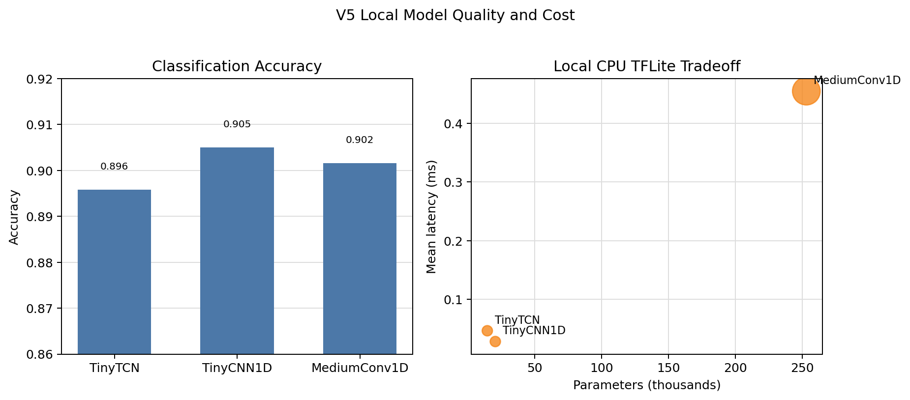
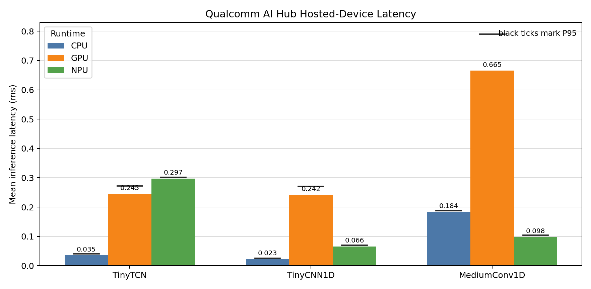
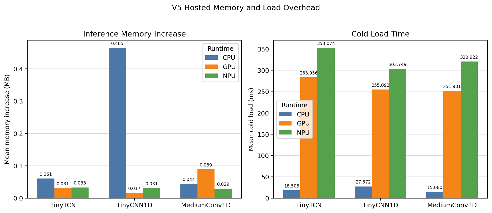
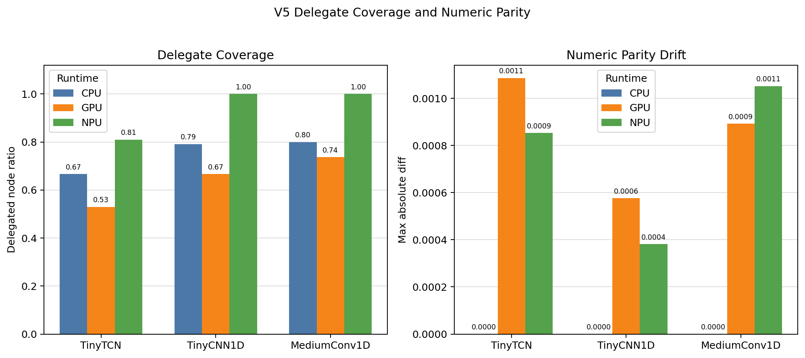

# V5 Curated Experiment Results

This directory contains lightweight, versioned summaries for the v5 CPU/GPU/NPU complexity sweep. It intentionally excludes raw datasets, model binaries, TFLite files, downloaded Qualcomm runtime logs, and downloaded AI Hub profile artifacts.

## Contents

- `local/`: UCI HAR local metrics, confusion matrices, op audits, training summaries, and local TFLite CPU benchmark summaries for TinyTCN, TinyCNN1D, and MediumConv1D.
- `qualcomm/aggregate_summary.json`: grouped Qualcomm AI Hub profile metrics from 45 real hosted-device profile jobs.
- `qualcomm/repeated_real/manifest.*`: profile matrix manifest for 3 models x 3 runtimes x 5 runs.
- `qualcomm/profile_runs/`: sanitized per-run profile summaries without raw logs or downloaded profile artifacts.
- `qualcomm/parity/`: numeric parity summaries for 3 models x 3 runtimes.
- `figures/`: matplotlib figures generated from the curated summaries.

## Figures









## Regenerate

Prepare the curated result package from local ignored outputs:

```bash
uv run python scripts/prepare_v5_results.py \
  --outputs-dir outputs/v5 \
  --qualcomm-dir outputs/qualcomm_ai_hub/v5 \
  --results-dir results/v5
```

Regenerate the figures:

```bash
uv run python scripts/generate_v5_result_figures.py \
  --results-dir results/v5 \
  --figures-dir results/v5/figures
```
